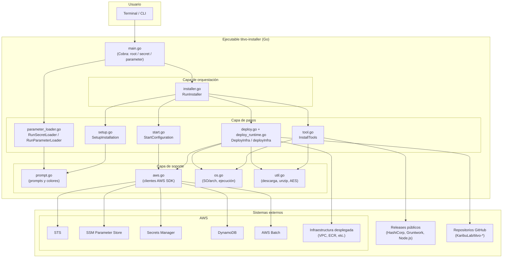

# Arquitectura del proyecto

Este documento describe la arquitectura interna del **Titvo Installer**: cómo está organizado el código, qué responsabilidad tiene cada archivo y cómo interactúa el instalador con los sistemas externos (AWS, repositorios de código y descargas de herramientas).

---

## 1. Visión general

El Titvo Installer es un ejecutable de línea de comandos escrito en **Go** que orquesta la instalación completa de la plataforma Titvo Security Scan sobre **AWS**. Su responsabilidad es:

1. Recolectar la configuración del usuario (interactiva o desde archivo).
2. Descargar las herramientas de infraestructura (Terraform, Terragrunt, Node.js).
3. Clonar y desplegar los distintos repositorios de infraestructura usando Terragrunt/Terraform.
4. Registrar la configuración inicial (usuario, API key, parámetros) en DynamoDB.

El binario también ofrece dos subcomandos auxiliares (`secret` y `parameter`) para administrar la configuración una vez instalado.

---

## 2. Estructura de directorios

```
titvo-installer/
├── cmd/
│   └── titvo-installer/
│       └── main.go            # Punto de entrada: define comandos Cobra (root, secret, parameter)
├── internal/                  # Toda la lógica del instalador (paquete "internal")
│   ├── installer.go           # Orquestador principal (RunInstaller)
│   ├── setup.go               # Recolección de configuración interactiva y tipos de credenciales
│   ├── prompt.go              # Utilidades de entrada/salida por consola (prompts, colores)
│   ├── tool.go                # Descarga e instalación de Terraform, Terragrunt y Node.js
│   ├── deploy.go              # Fuentes de repositorios y firma pública de despliegue
│   ├── deploy_runtime.go      # Lógica real de despliegue (deployInfra)
│   ├── start.go               # Configuración inicial: usuario, API key, parámetros en DynamoDB
│   ├── aws.go                 # Cliente AWS (SSM, Secrets Manager, DynamoDB, Batch, STS)
│   ├── os.go                  # Detección de SO/arquitectura y ejecución de comandos
│   ├── util.go                # Descarga de archivos, descompresión y cifrado AES
│   ├── parameter_loader.go    # Subcomandos secret/parameter
│   └── *_test.go              # Pruebas unitarias
├── Taskfile.yaml              # Build multiplataforma (incluye Taskfile_<os>.yaml)
├── go.mod / go.sum            # Dependencias
└── docs/                      # Documentación técnica
```

---

## 3. Diagrama de arquitectura

El siguiente diagrama muestra las capas del proyecto y sus interacciones con los sistemas externos.



---

## 4. Descripción de las capas

### 4.1. Punto de entrada (`cmd/titvo-installer/main.go`)

Define la interfaz de línea de comandos usando **Cobra**. Registra tres comandos:

- **root** (`titvo-installer`): ejecuta `internal.RunInstaller` (la instalación completa).
- **secret**: ejecuta `internal.RunSecretLoader` (agrega un secreto cifrado).
- **parameter**: ejecuta `internal.RunParameterLoader` (agrega un parámetro en texto plano).

Todos los comandos aceptan los flags `--debug` (`-d`) y `--config` (`-c`).

### 4.2. Capa de orquestación (`installer.go`)

`RunInstaller` es el orquestador que coordina los **cuatro pasos** principales de la instalación, en orden estricto:

1. **Setup** — obtener la configuración (archivo o interactiva).
2. **Install Tools** — descargar herramientas.
3. **Deploy Infra** — desplegar la infraestructura.
4. **Start Configuration** — registrar la configuración inicial.

Si cualquier paso falla, el proceso se detiene (`printErrorAndExit`).

### 4.3. Capa de pasos

Cada paso vive en su propio archivo y tiene una responsabilidad clara:

| Paso | Archivo | Función principal | Responsabilidad |
|------|---------|-------------------|-----------------|
| Setup | `setup.go` | `SetupInstallation` | Recolectar credenciales y parámetros del usuario. |
| Herramientas | `tool.go` | `InstallTools` | Descargar Terraform, Terragrunt y Node.js en `~/.titvo/bin`. |
| Despliegue | `deploy.go` / `deploy_runtime.go` | `DeployInfra` → `deployInfra` | Clonar repos y aplicar Terragrunt/Terraform. |
| Configuración | `start.go` | `StartConfiguration` | Crear usuario, API key y parámetros en DynamoDB. |
| Administración | `parameter_loader.go` | `RunSecretLoader` / `RunParameterLoader` | Subcomandos post-instalación. |

### 4.4. Capa de soporte

Módulos transversales reutilizados por los pasos:

- **`prompt.go`** — Lectura de entradas por consola (`askForInput`, `askForPassword`, `askForYesNo`, `askForChoices`) y salida con colores (`printInfo` verde, `printAskQuestion` amarillo, `printError` rojo).
- **`aws.go`** — Envoltorios sobre el **AWS SDK for Go v2** para STS (`GetAccountID`), SSM Parameter Store (`PutParameter`, `GetParameter`), Secrets Manager (`CreateSecret`, `GetSecret`), DynamoDB (`PutRecord`) y AWS Batch (`SubmitBatchJob`).
- **`os.go`** — Detección de sistema operativo y arquitectura (`GetOS`, `GetArch`) y ejecución de comandos externos (`ExecuteWithOptions`) con manejo de variables de entorno y PATH.
- **`util.go`** — Descarga de archivos por HTTP (`downloadFile`), descompresión (`extractTarGz`, `extractZip`) y cifrado AES-ECB con padding PKCS7 (`encrypt`).

---

## 5. Inyección de dependencias para pruebas

El archivo `deploy_runtime.go` define **variables de función** (por ejemplo `executeWithOptionsFn`, `getAccountIDFn`, `putParameterFn`, `submitBatchJobFn`, etc.) que apuntan por defecto a las implementaciones reales. Esto permite que las pruebas unitarias (`deploy_runtime_test.go`, `deploy_test.go`) sustituyan esas funciones por *mocks*, aislando la lógica de despliegue de las llamadas reales a AWS o a comandos del sistema.

De forma similar, `deploy.go` expone `downloadSourceFn` y `deployInfraFn` como puntos de sustitución.

---

## 6. Sistemas externos

El instalador interactúa con tres tipos de sistemas externos:

1. **Servicios de descarga de herramientas** (HTTP):
   - Terragrunt: `github.com/gruntwork-io/terragrunt/releases`
   - Terraform: `releases.hashicorp.com`
   - Node.js: `nodejs.org`

2. **Repositorios de código** (Git, organización `KaribuLab`): infraestructura base, agente, MCP gateway, RAG indexer, publicador de ECR, componentes de reporte (Bitbucket/GitHub/issue) y componentes core (auth setup, task cli files, task trigger, task status).

3. **AWS** (vía SDK): STS, SSM Parameter Store, Secrets Manager, DynamoDB y AWS Batch, además de toda la infraestructura que se despliega con Terragrunt.

---

## 7. Artefactos en disco

Durante la ejecución, el instalador crea la siguiente estructura en el directorio *home* del usuario:

```
~/.titvo/
├── bin/                       # Binarios de Terraform y Terragrunt
├── node-v20.19.4-<os>-<arch>/ # Node.js descomprimido
├── terraform-plugins/         # Caché de providers (TERRAGRUNT_PROVIDER_CACHE_DIR)
└── infra/                     # Repositorios clonados de infraestructura
    ├── titvo-security-scan-infra-aws/
    ├── titvo-agent-aws/
    ├── titvo-mcp-gateway/
    └── ...                     # Resto de componentes
```

Para entender el flujo dinámico paso a paso, consulta [diagramas-secuencia.md](./diagramas-secuencia.md).
