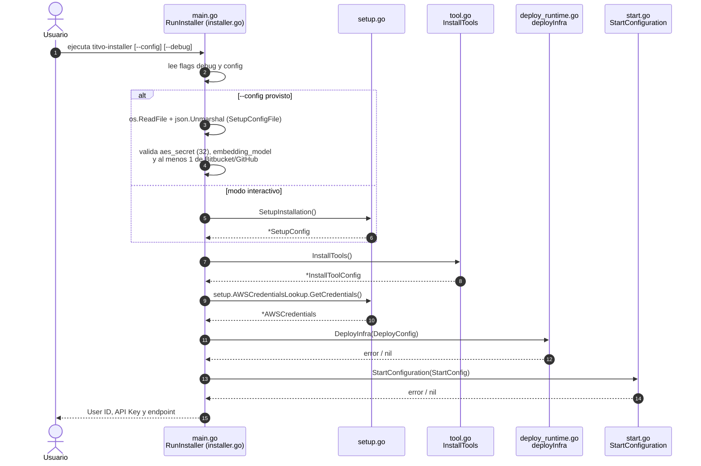
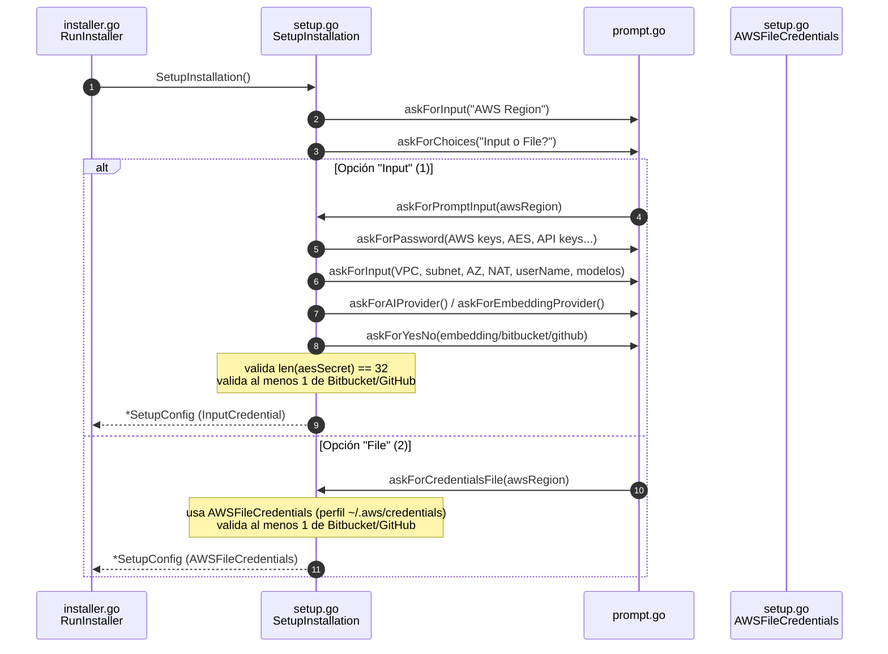
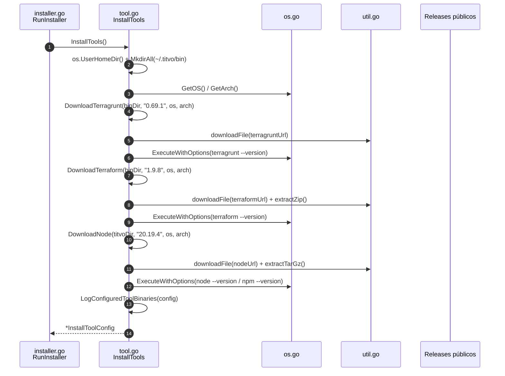
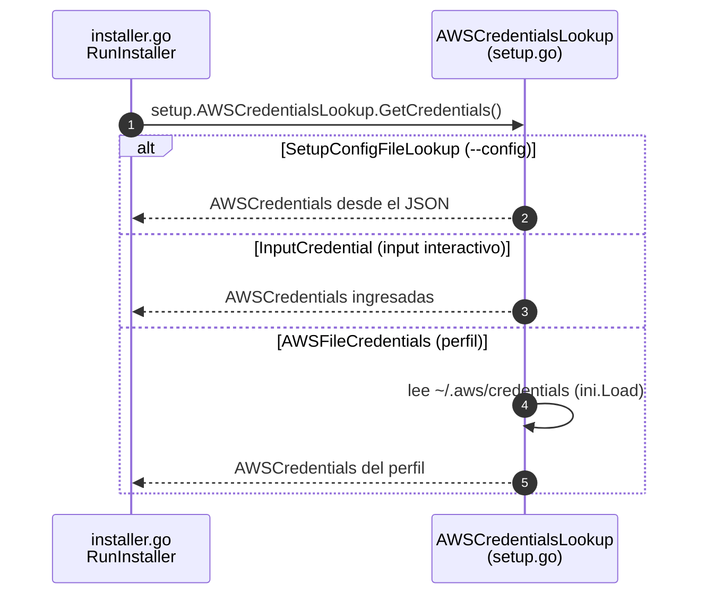
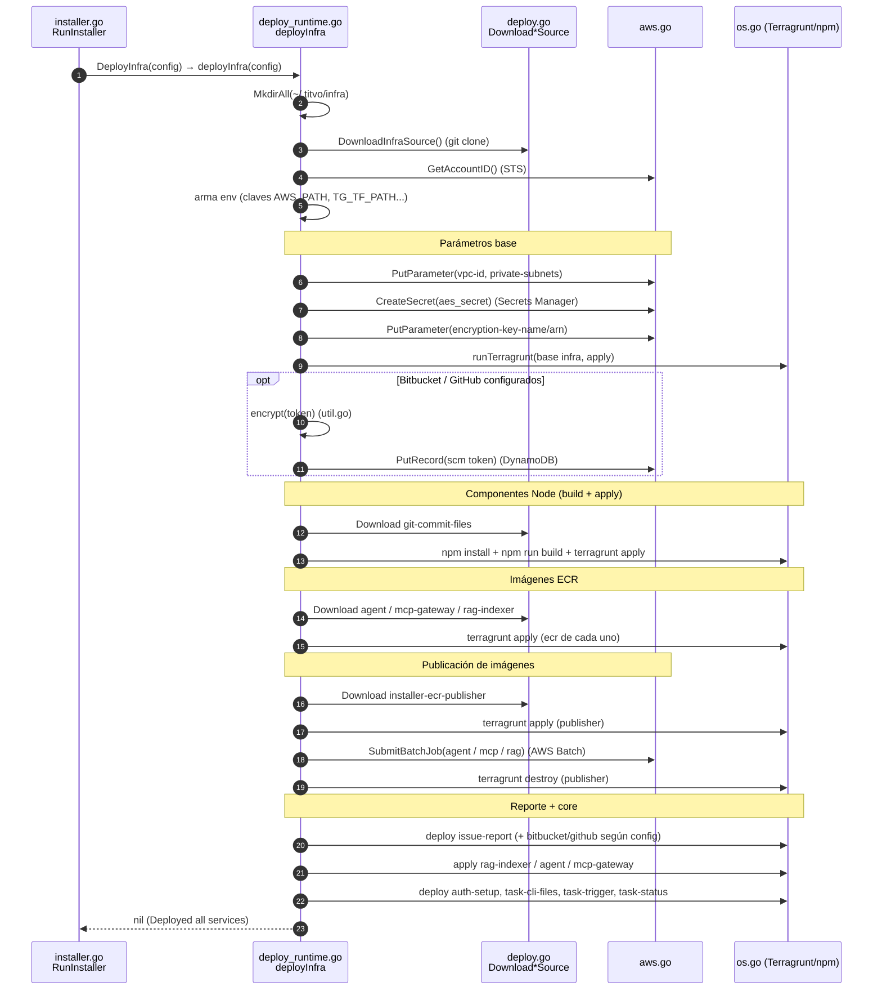
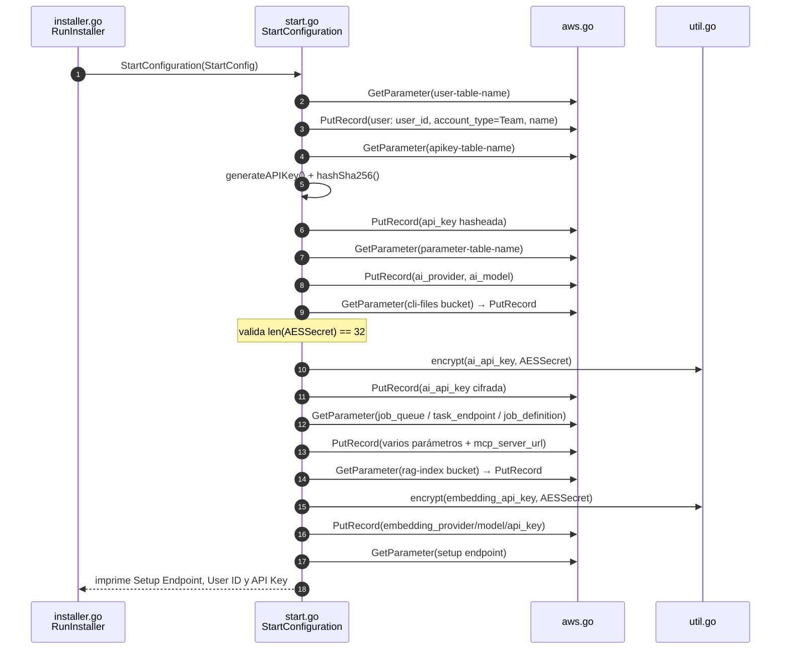
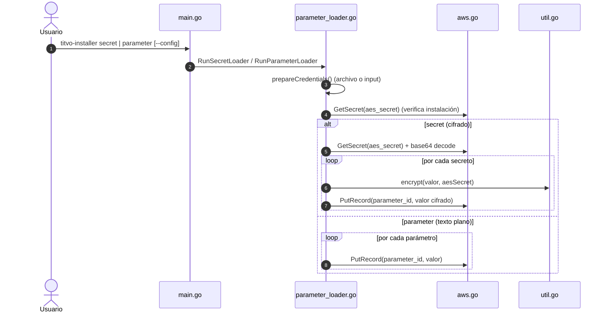

# Diagramas de secuencia

Este documento describe, paso a paso, el flujo de ejecución del instalador definido en [`internal/installer.go`](../internal/installer.go), función `RunInstaller`.

`RunInstaller` orquesta cuatro pasos en orden estricto. Si alguno falla, el proceso se detiene con `printErrorAndExit`:

1. **Setup** — obtención de la configuración.
2. **Install Tools** — descarga de herramientas.
3. **Deploy Infra** — despliegue de la infraestructura en AWS.
4. **Start Configuration** — registro de la configuración inicial.

Cada diagrama indica el **archivo Go** y las **funciones** involucradas.

---

## Diagrama general (orquestación)

Vista de alto nivel del flujo completo en `RunInstaller`.

**Explicación:**

`RunInstaller` ([`installer.go`](../internal/installer.go)) primero obtiene los flags `debug` y `config` desde Cobra. Si se entregó un archivo de configuración, lo lee con `os.ReadFile`, lo deserializa a `SetupConfigFile` y valida tres reglas críticas: el `aes_secret` debe tener 32 caracteres, `embedding_model` no puede estar vacío y debe existir al menos uno de `bitbucket_api_token` o `github_access_token`. Si no hay archivo, delega en `SetupInstallation` para el flujo interactivo. Luego ejecuta secuencialmente `InstallTools`, obtiene las credenciales AWS mediante la interfaz `AWSCredentialsLookup`, despliega la infraestructura con `DeployInfra` y finaliza con `StartConfiguration`, que imprime el resumen final.

---

## Paso 1 — Setup (`setup.go`, `prompt.go`)

Obtención de la configuración. Solo aplica el flujo interactivo cuando **no** se pasa `--config`.

**Explicación:**

`SetupInstallation` ([`setup.go`](../internal/setup.go)) pregunta primero la región de AWS y luego ofrece dos formas de entregar credenciales mediante `askForChoices`:

- **Input** (`askForPromptInput`): el usuario escribe todos los datos directamente. Los valores sensibles (claves de AWS, AES, API keys, tokens) se leen con `askForPassword` (entrada oculta). Aquí se valida que el `aes_secret` tenga exactamente 32 caracteres. El proveedor de IA y de embeddings se eligen con `askForAIProvider` y `askForEmbeddingProvider`. La integración de Embeddings es opcional, pero se debe proporcionar **al menos una** credencial de Bitbucket o GitHub (pueden ser ambas); si no se entrega ninguna, el proceso se detiene con un error. Devuelve un `SetupConfig` con un `InputCredential`.
- **File** (`askForCredentialsFile` en [`prompt.go`](../internal/prompt.go)): el usuario indica un perfil de AWS; las credenciales se leerán del archivo `~/.aws/credentials` mediante `AWSFileCredentials`. También aquí se exige al menos una credencial de Bitbucket o GitHub.

> Cuando se usa `--config`, este paso se omite: `RunInstaller` construye el `SetupConfig` directamente desde el JSON usando un `SetupConfigFileLookup`.

---

## Paso 2 — Install Tools (`tool.go`, `util.go`, `os.go`)

Descarga e instalación de Terragrunt, Terraform y Node.js en `~/.titvo`.

**Explicación:**

`InstallTools` ([`tool.go`](../internal/tool.go)) resuelve el directorio *home* del usuario y crea `~/.titvo/bin`. Detecta el sistema operativo y la arquitectura con `GetOS`/`GetArch` ([`os.go`](../internal/os.go)) para elegir las URLs de descarga correctas. Luego descarga, en orden, tres herramientas con versiones fijas:

- **Terragrunt** `0.69.1` (`DownloadTerragrunt`): se descarga el binario con `downloadFile` y, en sistemas no Windows, se le da permiso de ejecución (`os.Chmod`).
- **Terraform** `1.9.8` (`DownloadTerraform`): se descarga un ZIP y se descomprime con `extractZip` ([`util.go`](../internal/util.go)); el ZIP se elimina al final.
- **Node.js** `20.19.4` (`DownloadNode`): se descarga un `tar.gz` y se descomprime con `extractTarGz`.

Tras cada descarga se valida el binario ejecutando `--version` con `ExecuteWithOptions`. Finalmente, `LogConfiguredToolBinaries` verifica que los cuatro binarios (Terragrunt, Terraform, Node, npm) existan y funcionen, y advierte si en el `PATH` del sistema hay versiones distintas. Devuelve un `InstallToolConfig` con todas las rutas.

---

## Paso 2.5 — Obtención de credenciales AWS (`setup.go`)

Entre el paso 2 y el 3, `RunInstaller` resuelve las credenciales AWS.

**Explicación:**

`AWSCredentialsLookup` ([`setup.go`](../internal/setup.go)) es una interfaz con tres implementaciones. Según cómo se obtuvo la configuración, `GetCredentials()` retorna las credenciales desde el JSON (`SetupConfigFileLookup`), desde los valores ingresados interactivamente (`InputCredential`) o leyendo el archivo `~/.aws/credentials` con el parser INI (`AWSFileCredentials`). Este patrón desacopla el origen de las credenciales del resto del flujo.

---

## Paso 3 — Deploy Infra (`deploy.go`, `deploy_runtime.go`, `aws.go`, `os.go`)

Despliegue de toda la infraestructura. Es el paso más extenso.

**Explicación:**

`DeployInfra` ([`deploy.go`](../internal/deploy.go)) delega en `deployInfra` ([`deploy_runtime.go`](../internal/deploy_runtime.go)). El flujo es:

1. **Preparación**: crea `~/.titvo/infra`, clona el repositorio base con `DownloadInfraSource` (un `git clone` vía `downloadSource`), obtiene el Account ID con `GetAccountID` ([`aws.go`](../internal/aws.go)) y arma el mapa de variables de entorno que recibirán Terragrunt y npm (credenciales AWS, `PATH` con los binarios descargados, `TG_TF_PATH`, caché de plugins, etc.). Con `--debug` se activan `TG_LOG` y `TF_LOG`.
2. **Parámetros base**: escribe `vpc-id` y la configuración de subred privada en SSM con `PutParameter`, crea el secreto `aes_secret` (codificado en base64) en Secrets Manager con `CreateSecret`, y guarda en SSM el nombre y ARN de la clave de cifrado.
3. **Infra base**: ejecuta `terragrunt run-all apply` sobre `prod/us-east-1` con `runTerragrunt` (que internamente usa `ExecuteWithOptions` de [`os.go`](../internal/os.go)).
4. **Secretos SCM (opcional)**: si se entregaron tokens de Bitbucket o GitHub, los cifra con `encrypt` ([`util.go`](../internal/util.go)) y los guarda en DynamoDB con `PutRecord`. Si faltan, se omite la integración con una advertencia.
5. **Componentes Node**: para componentes como `git-commit-files`, actualiza submódulos, ejecuta `npm install` + `npm run build` y luego `terragrunt apply` (`deployNodeComponent`).
6. **Imágenes ECR**: clona `agent`, `mcp-gateway` y `rag-indexer`, y aplica el módulo Terragrunt de su carpeta `aws/ecr` para crear los repositorios ECR.
7. **Publicación de imágenes**: despliega `installer-ecr-publisher`, lee de SSM el ARN de la job definition y job queue, lanza jobs de **AWS Batch** con `SubmitBatchJob` para publicar las imágenes (agente, MCP gateway, RAG indexer) y luego destruye el publisher con `terragrunt destroy`.
8. **Componentes de reporte y core**: despliega `issue-report` (y `bitbucket-code-insights`/`github-issue` según las integraciones activas), aplica las capas de `rag-indexer`, `agent` y `mcp-gateway`, y finalmente los componentes core: `auth-setup`, `task-cli-files`, `task-trigger` y `task-status`.

> **Nota sobre pruebas:** las llamadas a comandos externos y a AWS se realizan a través de variables de función (`executeWithOptionsFn`, `getAccountIDFn`, `putParameterFn`, `submitBatchJobFn`, etc.) definidas en `deploy_runtime.go`, lo que permite sustituirlas por *mocks* en los tests.

---

## Paso 4 — Start Configuration (`start.go`, `aws.go`, `util.go`)

Registro de la configuración inicial: usuario, API key y parámetros.

**Explicación:**

`StartConfiguration` ([`start.go`](../internal/start.go)) deja lista la configuración funcional de Titvo en DynamoDB. Su patrón general es: leer de SSM (`GetParameter`) los nombres de las tablas y recursos creados por la infraestructura, y luego insertar registros con `PutRecord` ([`aws.go`](../internal/aws.go)):

1. **Usuario**: lee el nombre de la tabla de usuarios y crea un registro con un `user_id` (UUID), `account_type = Team` y el nombre indicado.
2. **API Key**: genera una clave aleatoria con `generateAPIKey` (prefijo `tvok-`, 48 caracteres), la **hashea con SHA-256** (`hashSha256`) y guarda solo el hash. El valor en claro solo se mostrará al usuario al final.
3. **Parámetros de IA**: guarda `ai_provider` y `ai_model`. La `ai_api_key` se **cifra con AES** (`encrypt` de [`util.go`](../internal/util.go), que exige clave de 32 caracteres) antes de guardarse.
4. **Parámetros de infraestructura**: guarda el bucket de archivos de la CLI, la cola y definición de jobs de Batch, los endpoints de la API y la URL del MCP server.
5. **Parámetros de embeddings**: si `embedding_provider` o `embedding_api_key` están vacíos, usa como respaldo los valores de IA. El `embedding_model` se guarda en texto plano y la API key de embeddings se cifra.
6. **Resumen final**: imprime el Setup Endpoint, el `User ID` y la `API Key` en claro, recordando al usuario guardarlos en un lugar seguro (se muestran una sola vez).

---

## Flujos auxiliares — Subcomandos `secret` y `parameter` (`parameter_loader.go`)

No forman parte de `RunInstaller`, pero son parte del mismo binario y se usan después de instalar.

**Explicación:**

Ambos comandos ([`parameter_loader.go`](../internal/parameter_loader.go)) comparten `prepareCredentials`, que obtiene las credenciales AWS (desde `--config` o por input) y verifica que Titvo esté instalado intentando leer el secreto `aes_secret` con `GetSecret`. Si no existe, aborta indicando que primero hay que ejecutar el instalador.

- `RunSecretLoader`: obtiene la clave AES desde Secrets Manager, la decodifica de base64, y en un bucle pide pares nombre/valor, **cifra** cada valor con `encrypt` y lo guarda en la tabla `tvo-security-scan-parameter-prod` con `PutRecord`.
- `RunParameterLoader`: similar, pero guarda los valores **en texto plano** (sin cifrar).
